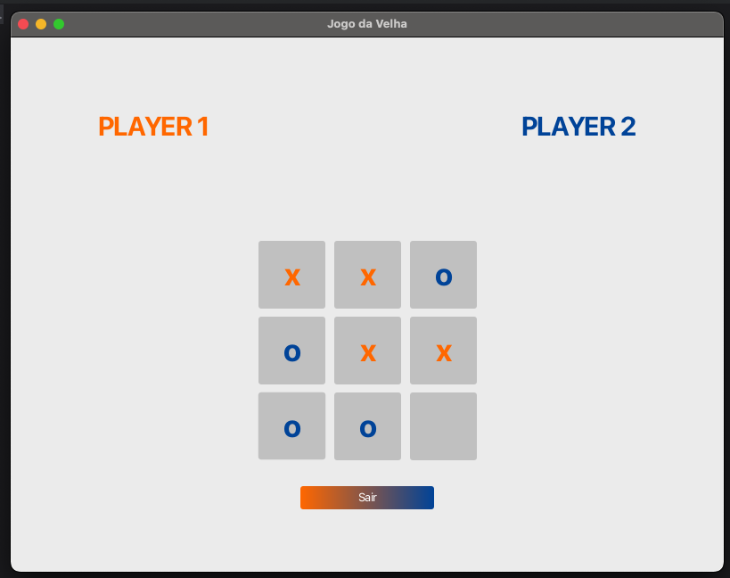

## 🎮 Jogo da Velha com JavaFX

Um simples e divertido jogo da velha (Tic Tac Toe) implementado com JavaFX, onde dois jogadores humanos se enfrentam em uma interface gráfica amigável.

## 📸 Captura de Tela



## 🚀 Funcionalidades

Interface gráfica desenvolvida com JavaFX

Dois jogadores (modo local)

Verificação automática de vitória e empate

Design limpo e intuitivo

## 🛠 Tecnologias utilizadas

Java 17+

JavaFX (SDK incluído ou configurado via Maven/Gradle)

IDE recomendada: IntelliJ IDEA ou Eclipse

## 📦 Como executar o projeto

✅ Pré-requisitos
Java JDK instalado

JavaFX SDK (se não estiver usando Maven/Gradle)

Uma IDE Java (IntelliJ, Eclipse ou VSCode)

## 🧭 Passos

Clone o repositório:

```bash
git https://github.com/Helder-Souza/tic_tac_toe.git
cd tic_tac_toe
```

Rode com:

```bash
mvn clean javafx:run
```

Se estiver abrindo manualmente na IDE:

Adicione o JavaFX SDK ao projeto

Configure as VM options, por exemplo:

```css
--module-path /caminho/para/javafx/lib --add-modules javafx.controls,javafx.fxml
```
## 🧠 Como jogar

Clique em uma célula para fazer sua jogada.

O jogo alterna entre os jogadores X e O.

O jogo detecta automaticamente vitórias ou empates.

O jogo exibe o placar a cada vitória.

## 👨‍💻 Estrutura do Projeto

```css
tic_tac_toe/
│
├── src/
│   ├── main/
│   │   ├── java/
│   │   │   └── com/game/tictactoe/
│   │   │       ├── App.java
│   │   │       ├── BuildLabels.java
│   │   │       ├── ButtonService.java
│   │   │       ├── GameButton.java
│   │   │       ├── GameNotification.java
│   │   │       ├── Player.java
│   │   │       └── SceneFactory.java
│   │   └── resources/
│   │       └── com/game/tictactoe/
│   │           └── logo.png
│
├── pom.xml
└── README.md
```

## 🤝 Contribuições
Contribuições são bem-vindas! Sinta-se à vontade para abrir issues ou enviar pull requests.

## 📄 Licença
Este projeto está licenciado sob a Licença MIT - veja o arquivo [LICENSE](./LICENSE) para detalhes.

## ✍️ Autor
### Helder Souza - [@heldersouza](https://github.com/Helder-Souza)